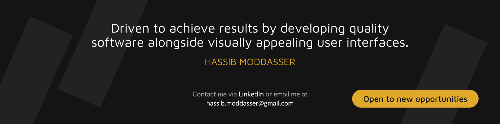

# Hi there , I'm Hassib

I am a **Software Engineer** and a **Full-Stack Web Developer** having more than four years of extensive experience in all phases of small-scale to enterprise-scale projects.

I have used many updated tools, technologies, and techniques to solve problems. I am focused on being a valuable part of any team I am on and believe in team success, growth, and team rising together.

I am also passionate about **blogging** and have published numerous articles.

- 🏢 &nbsp;I'm a freelance **Full-Stack Web Developer** and **Content Creator**
- 🌱 &nbsp;I'm currently learning [Next.js](https://nextjs.org/) and [Angular](https://angular.io/)
- 👯 &nbsp;I'm looking for open source collaboration
- 💬 &nbsp;Ask me about **Web** and **JavaScript**, I'm happy to help
- 📫 &nbsp;Reach me through [Twitter DMs](https://twitter.com/hassibmoddasser) or my **Email Address** on my profile
- ⚡ &nbsp;I write code without drinking coffee

 

  

 

Connect with me on these excellent platforms; I would love to talk more

   &ensp;
   &ensp;
   &ensp;
   &ensp;
   &ensp;
   &ensp;
  

 

## Tech Stack

I work with many different technologies and languages, but my favorites are **JavaScript**, **React.js**, **Next.js**, **Node.js**, and **Express.js**.

   &emsp;
   &emsp;
   &emsp;
   &emsp;
   &ensp;
   &ensp;
   &emsp;
   &emsp;
   &emsp;
   &emsp;
   &emsp;
   &emsp;
   &emsp;
   &emsp;
   &emsp;
   &emsp;

## Recent articles

- [Understand how to use Clean Architecture in Express JS Applications](https://merlino.agency/blog/clean-architecture-in-express-js-applications)
- [What is React JS? — An introduction to the "Whats & Whys" of React Library](https://hassib.hashnode.dev/what-is-react-js-an-introduction-to-the-whats-and-whys-of-react-library)
- [What is JSON? — Everything you need to know about](https://hassib.hashnode.dev/what-is-json-everything-you-need-to-know-about)
- [A Comprehensive Guide to String Methods of JavaScript](https://hassib.hashnode.dev/a-comprehensive-guide-to-string-methods-of-javascript)
- [What is Node.js? — A beginner's introduction to the JavaScript in the Server](https://hassib.hashnode.dev/what-is-nodejs-a-beginners-introduction-to-the-javascript-in-the-server)
